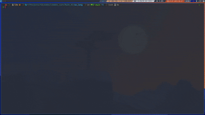

  
 


 
# So Long Game


## Project Description

This repository contains **So Long**, a 2D game project from the 42 curriculum. The goal is to create a small game using the MiniLibX graphical library. Players must navigate a rectangular map to collect all items before reaching the exit, while avoiding walls.

### Game Mechanics

  * **Controls**: The game recognizes both the **WASD keys and the arrow keys** for player movement.
  * **Move Counter**: Each valid movement updates an on-screen counter, which is also printed to the console.
  * **Winning Condition**: The player wins when they have collected all items and successfully reach the exit (`E`). Upon winning, the game automatically closes.

### Map Validation

The program rigorously validates the map file (`.ber`) to ensure it complies with the game rules:

  * **Shape**: The map must be **rectangular**, with all rows having the same length.
  * **Walls**: The map must be completely **surrounded by walls** (`1`). The first and last characters of each row, as well as the first and last rows themselves, must be walls.
  * **Characters**: Only a specific set of characters is allowed (`0`, `1`, `C`, `P`, `E`).
  * **Entities**: The map must contain **exactly one player** (`P`), **exactly one exit** (`E`), and **at least one collectible** (`C`).
  * **Path Check**: A Depth-First Search (`DFS`) algorithm is used to verify that there is a valid path from the player's starting position to every collectible and the exit. If no valid path exists, the map is considered invalid.

### Bonus Features

As part of the bonus implementation, a **HUD for the move counter** was added. In addition to printing the number of steps to the console, the game displays the move count visually on the screen within a dedicated frame.

### Code Structure

The project is organized into several modules to separate concerns, primarily focusing on game logic and map parsing.

  * **`src/main.c`**: The program's entry point.
  * **`src/game/`**: Contains the core game logic, including event handling, state updates, and rendering.
  * **`src/map/`**: Handles all aspects of map parsing, reading from the `.ber` file, and validating its structure.
  * **`includes/`**: Contains various header files defining game structures, constants, and function prototypes.
  * **`libft/`**: This project relies on a custom library of C functions. You can find the source code [here](https://github.com/leonel-carrizo/libft).

## How to Use

1.  Clone the repository and compile the program with `make`:
    ```bash
    git clone https://github.com/leonel-carrizo/so_long.git
    cd so_long
    make
    ```
2.  Run the game, providing a valid `.ber` map file as an argument. Example maps are in the `Assets/Maps/` folder, and you can also create your own custom maps.
    ```bash
    ./so_long assets/maps/map.ber # others: map_small.ber map_medium.ber map_so_big.ber
    ```

## Contact

  * **GitHub**: [leonel-carrizo](https://github.com/leonel-carrizo)

Feel free to explore the code or reach out with any questions.
